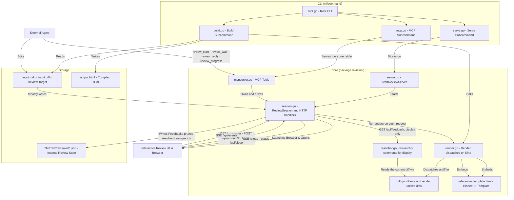

# reviewer Design Overview (DESIGN)

This document describes the internal design, system architecture, and component data flows of the `reviewer` spec compiler and review server.

---

## 1. System Architecture

`reviewer` is packaged as a single Go binary that orchestrates four primary layers:

1. **CLI Layer (`github.com/alecthomas/kong`)**
   Parses command-line arguments and dispatches commands (`build`, `serve`, `mcp`).
2. **Rendering Layer (`github.com/yuin/goldmark`, `diff.go`)**
   Decides from the content whether the review target is Markdown or a unified diff. Markdown is
   parsed as GFM with metadata (via `goldmark-meta`); a diff is parsed into files, hunks and lines
   by reviewer's own parser. Both are translated into the body of the same page.
3. **Review Server Layer (`net/http`)**
   Hosts an interactive web application UI (built using standard HTML/JS/CSS) and provides endpoints to record reviewer feedback.
4. **MCP Layer (`github.com/modelcontextprotocol/go-sdk`)**
   Serves the agent-facing contract over stdio as four tools. It owns a `ReviewSession` and drives
   it in-process; it does not go through HTTP.

### Architecture Overview Diagram



---

## 2. Core Components

### A. CLI Commands (`cli/command/`)
* **`root.go`**: Establishes global parameters and instantiates command context.
* **`build.go`**: Compiles the input — a Markdown document or a unified diff — into a standalone, styled HTML file. Output defaults to the same directory as the input.
* **`serve.go`**: Compiles the input, spins up the local HTTP web server, and triggers the operating system's default browser to load the review application.
* **`mcp.go`**: Runs the MCP server over stdio. `--wait-timeout` (default `15m`) bounds one
  `review_wait` call; `--port` and `--no-open` mirror `serve`.

### B. Renderer (`reviewer/render.go`, `reviewer/diff.go`)

`Render` is the single entry point every call site uses (`build`, `serve`, `GET /`). It calls
`DetectKind` on the content and dispatches: Markdown goes to `RenderSpec`, a unified diff to
`ParseUnifiedDiff` + `RenderDiff`. Both produce a body and hand it to the same page template,
which branches on `SpecMetadata.Mode`.

* **Content-based detection**:
  The kind comes from the bytes, never from the file name or a flag. An agent writes its diff to
  a temp file whose name says nothing, and a flag would have to be threaded through every entry
  point and then answered correctly by an agent that has no reason to care. Fenced code blocks are
  skipped while detecting, so a spec that quotes a diff is still a spec — misreading one would
  strip its formatting and orphan every existing comment anchor.
* **The diff path does not post-process**:
  Badge and callout rewriting would corrupt code, so `postProcessHTML` is skipped. That removes
  the one thing making the Markdown path safe in a `text/template`, so `RenderDiff` escapes
  **every** diff-derived string itself: line content, hunk headers, and paths, which also land in
  attribute values. Hunk headers matter as much as content — a diff touching
  `func (s *ReviewSession) Done() <-chan struct{}` puts `<-chan` straight into one.
* **Whitespace-only pairs are marked, not removed**:
  `whitespaceOnlyMask` tags both halves of a whitespace-only change with `data-ws-only`, and the
  page folds them in CSS. Removing them here instead would renumber every line after the fold and
  orphan the comments anchored to them, so the renderer decides *which* lines are foldable and the
  toggle decides *whether* they are shown. Since reviewer never runs git, `git diff -w` cannot be
  re-run against the sources: a run of deletions is paired 1:1 with the run of additions that
  follows it, and only when both runs are the same length and every row matches with whitespace
  stripped. Unequal runs fold nothing — the pairing they imply is guesswork, and a wrong fold hides
  a real edit.
* **Own parser, kept swappable**:
  The display-oriented shape a review page needs (line kind, both-side numbers, file boundaries,
  a stable per-file line index) ends up hand-written whichever library is used. It is plain
  functions with no interface in the way, so swapping in `go-gitdiff` later is a local change.

Converts raw GFM Markdown into interactive, presentation-ready HTML. In addition to standard GFM translation, it performs custom **HTML post-processing**.

* **Safe Post-Processing Design (Masking Logic)**:
  To prevent the post-processor's regular expressions from polluting sample code blocks (`<pre>` and `<code>` tags) written by the spec author, a strict "Mask & Restore" sequence is executed:
  1. Standard code blocks are extracted via `codeBlockRegex` and replaced with unique placeholders (`<!--CODE_BLOCK_PLACEHOLDER_N-->`).
  2. Modifications are applied to the remaining markup (e.g., embedding Mermaid figures, applying `spec-table` styles, injecting badges, and building callout containers).
  3. Once all modifications are done, the original code blocks are restored into their placeholder positions.
* **Static Regex Compilation**:
  To eliminate execution-time compilation overhead under load, all regex objects (`mermaidRegex`, `calloutRegex`, `codeBlockRegex`) are compiled at the global scope using `regexp.MustCompile`.

### C. Review Session (`reviewer/session.go`)

A `ReviewSession` is one live review of one document. It owns the listener, the SSE hub, the
submit notifier, the file watcher, and the shutdown signal, and it exposes the three agent
operations directly: `Wait`, `Reply`, `Progress`.

`StartSession` returns as soon as the port is bound, leaving the caller to decide how to wait.
`StartReviewServer` — the entry point for `reviewer serve` — starts a session and blocks on
`Done()`. The MCP server instead keeps the handle and drives it across tool calls.

* **Two-Once shutdown**:
  `done` signals "the session is over"; a separate `sync.Once` guards the HTTP shutdown. They
  must stay separate: on the **End Review** path `/api/close` closes `done` first and the owner
  calls `Close()` afterwards, so a shared `Once` would skip the shutdown and leak the port.
* **Submit sequence counter**:
  `submitSeq` counts submits and `deliveredSeq` records how far `Wait` has reported. The notifier
  only wakes waiters present at broadcast time, so a submit landing while the agent edits the
  document — between one `Wait` returning and the next being called — would otherwise be lost and
  the agent would report a timeout with comments unanswered. `Wait` subscribes first, then checks
  the counters, so a submit racing in between wakes the channel instead of slipping past both.
* **`Wait` never returns an error**:
  It reports `submitted`, `timeout`, or `session_ended` as a value. A cancelled caller context
  maps to `timeout` ("nothing happened, call again") rather than `session_ended`, which would end
  the agent's loop on a cancelled call.
* **Sidecar mutual exclusion (`sidecarMu`)**:
  Sidecar reads and writes are plain `os.ReadFile` / `os.WriteFile` and are not atomic against
  each other, so one mutex covers the four paths that touch the file: the write in
  `POST /api/feedback`, the read-modify-write in `Reply`, the read in `GET /api/feedback`, and
  the read in `GET /api/wait`. It is taken at handler and method entry and **never inside
  `readFeedbackDoc`** — `Reply` calls that helper while already holding it, and `sync.Mutex` is
  not reentrant, so locking in the shared helper would deadlock the server outright. `Wait` is the
  deliberate exception: it locks around each read rather than at entry, because it blocks for up
  to 15 minutes and holding the lock that long would block the submit that is the only thing able
  to wake it — with no cycle for Go's deadlock detector to see.

### D. Review Server (`ReviewSession.newMux` in `reviewer/session.go`)

The server hosts a **persistent, in-page review loop** (hunk-inspired): the user comments and
submits, the agent updates the document and replies, and the open page auto-reloads. Submitting
does **not** shut the server down.

These HTTP endpoints serve the browser and `reviewer serve`. The agent no longer uses them; it
goes through MCP.

* **Dynamic Port Allocation**:
  If the default port (`5500`) is in use, the server dynamically catches this error and queries a free port using `net.Listen("tcp", "127.0.0.1:0")`.
* **On-the-fly rendering (`GET /`)**:
  The document is re-rendered from the source file on every request, so the agent's edits appear
  on the next reload. (The server no longer serves a byte slice captured at startup.)
* **`/api/feedback`**:
  * `GET`: Returns the feedback document as `{ "comments": [...], "summary": "..." }`. A missing
    file yields `{"comments":[]}`. **When the review target is a diff, the comments are
    re-anchored against it first** — for display only, never written back (see section 5). A
    Markdown session is passed through untouched: without that guard every block anchor would
    fail the file lookup, turn `outdated`, and the Markdown review would silently lose its
    indicators and connector lines.
  * `POST`: Unmarshals the incoming `Feedback`, **merges it over the stored sidecar**, **prunes
    comments the user marked `resolved`**, **assigns an `id` to any comment lacking one**, writes
    the file, **records the submit and releases any waiter** (both `ReviewSession.Wait` and `GET
    /api/wait`), and **keeps the server running** so the agent can pick up the comments.

    The merge (`mergeFeedback`) is there because the page holds its reload while the human has
    unsent edits, so the array it posts back can be older than the sidecar. Writing that array
    straight through dropped every reply and every thread the agent had appended in between. The
    stored sidecar is authoritative for agent-authored content; the payload is authoritative for
    human-authored content, deletions included, so a thread the human removed stays removed along
    with the agent replies inside it.

    No record of which revision the page read is needed to tell those two cases apart. The page has
    no control that edits or deletes an agent message, and none that deletes an agent-opened thread
    (§F), so agent-authored content missing from the payload is always content the page had not
    loaded yet — never something the human took out. The single exception is `declined`, which the
    human stamps onto the agent's own message when closing a question unanswered: the agent messages
    the page did see are therefore taken from the payload, and only the ones past that point come
    from the sidecar.

  This handler no longer writes `FEEDBACK_RECEIVED` to stdout. Stdout is the JSON-RPC transport in
  `reviewer mcp`, so any write there corrupts the protocol stream (see `AGENTS.md` §7).
* **`GET /api/wait` (long-poll)**:
  Blocks until the next `POST /api/feedback`, then returns `200` with the current feedback JSON.
  With no activity it returns `204` after `waitTimeout` (25s) so the client re-polls (long-poll
  convention); the session ending (`/api/close` / context cancellation) or the client
  disconnecting also releases the waiter. Fan-out is handled by a `submitNotifier` (mirrors
  `sseHub`, but signal-only) so multiple concurrent waiters are all released by a single submit.

  This endpoint exists for `reviewer serve`. Agents use `review_wait`, which adds the pending-submit
  handling described in §C; `/api/wait` deliberately keeps its simpler semantics.
* **`POST /api/close`**:
  The page's **End Review** button hits this endpoint to end the session (graceful shutdown).
* **`GET /api/status`**:
  Returns the agent's current activity (`{ "state": "working|idle", "message": "..." }`) from the
  stored status file, so the page can restore the "working" indicator after a mid-round reload. A
  missing file yields `idle`. This is the only reason the status is written to disk at all; the
  live update reaches the page over SSE.
* **`GET /api/events` (SSE)**:
  A Server-Sent Events stream carrying **typed JSON events** so the page can react differently:
  * `{"kind":"reload"}` — the document or feedback changed; the page calls `location.reload()`.
  * `{"kind":"status","state":...,"message":...}` — the agent's activity changed; the page updates the
    live activity panel **in place**, without reloading.
* **File watching (`fsnotify`)**:
  The server watches the directory containing the `.md`, debouncing changes (~150ms) into a
  `reload`. This is how the agent's edits reach the browser with no explicit control call —
  the agent edits the document with its ordinary file tools, not through reviewer.

  Only the document is watched. The review state files were watched too while the agent wrote
  them directly; now the session is their only writer and broadcasts the SSE event itself, which
  is both simpler and faster. Watching them where they now live would also mean watching a
  directory shared by every review on the machine, where one session's writes would fire
  another session's page.
* **Graceful shutdown**:
  A single `done` signal (closed by `/api/close` or context cancellation) unblocks SSE handlers and
  blocked `/api/wait` waiters, and triggers `http.Server.Shutdown`.

### E. MCP Server (`reviewer/mcpserver.go`)

The agent-facing contract. `reviewer mcp` serves four tools over stdio; a `sessionHolder` owns at
most one live `ReviewSession` per process.

* **`review_start(path)` → `{url, path}`**:
  Stats the document before binding a port, so a path that cannot be read fails instead of
  yielding a URL to a page that only renders an error. Refuses a second start while a review is
  live, but allows one after the human ended the previous review.
* **`review_wait()` → `{outcome, comments, summary}`**:
  `outcome` is `submitted`, `timeout`, or `session_ended`. Waiting on a review that already ended
  reports `session_ended` rather than failing, because the human can click **End Review** while the
  agent is editing.
* **`review_reply(replies, newThreads, summary)`**:
  Each reply names a comment by `commentId` and is **appended** to that comment's thread as an
  agent message, so the human's own fields cannot be damaged and the agent cannot resolve a
  comment. A reply may carry `needsAnswer`, which marks it as a question the human is expected to
  answer. `newThreads` opens threads of the agent's own, each anchored to a quoted passage.

  Questions ride this tool rather than a `review_ask` of their own so that a round is **one
  read-modify-write and one SSE reload**: two tools would mean two POSTs, two reloads, and a page
  painting the state in between. The tool count stays at four.

  A quote is never validated: rejecting one the server cannot resolve would require Go to
  reproduce the browser's `spec-element-N` numbering. An unresolvable quote becomes a thread
  without a target (§3).
* **`review_progress(state, message)`**:
  Stores the status and pushes an SSE `status` event, so the page's activity panel updates in
  place without a reload.

* **Session lifetime is process-scoped, not call-scoped**:
  `sessionHolder` holds the MCP process's context and hands *that* to `StartSession`. Passing a
  tool call's request context would end the review the instant `review_start` returned.
* **Errors versus outcomes**:
  The SDK marks a returned Go error as `IsError` on the tool result. Only genuine agent mistakes —
  waiting before any review started, replying to an unknown comment id, an invalid progress state —
  return errors. Everything that is merely "what happened" comes back as a value.

### F. UI Template (`references/template.html`)
Embedded into the Go binary at compile-time using the standard `//go:embed` directive.

This section describes **how the template is structured and initialized**. Why the screen looks
and behaves the way it does — the design system, the layout policy and the interaction model —
is recorded in [UI_DESIGN.md](UI_DESIGN.md), which is normative for those decisions.

* **Responsive 3-Column Layout**:
  * **Contents Rail (Left)**: Renders the title, version and date (a diff shows its file count and
    +/− totals instead), and navigation — headings for a spec, the file list for a diff, where
    each entry carries a status mark. It folds away, and the collapsed state is remembered.
  * **Main Content (Middle)**: Renders the compiled body. For a diff the layout drops its
    1600px cap and the column is floored at `--document-min-width`.
  * **Feedback Panel (Right)**: Shows the comment inbox, list of active critiques, and submission options (visible only when served via HTTP). Unsubmitted comments can be edited inline or deleted before submission. Its width is draggable and remembered in `localStorage`; double-clicking the divider drops the stored value and removes the custom property.
* **Width and state live in custom properties and `<body>` classes, never in inline styles**:
  `--feedback-panel-width` and `--document-min-width` are read by the stylesheet, the resize handle
  and the narrow-viewport media queries alike; mode and layout state ride classes on `<body>`
  (`is-served`, `rail-collapsed`, `diff-review`). See UI_DESIGN.md §3.3 for why this is a
  hard rule rather than a preference.
* **Comment Display Order**:
  The feedback panel renders comments in the **appearance order of their target block** in the
  document. `commentsInAppearanceOrder()` builds an `anchor → position` map from the live DOM
  (`.document-column [data-anchor]`) and stable-sorts a `{comment, originalIndex}` view — so comments
  on the same block keep creation order, and the `idx`-based handlers (`editingIdx`,
  `deleteComment`, `saveComment`) continue to address the untouched `comments` array. Comments
  with no anchor, or whose anchored element disappeared after an agent edit, sink to the end in
  creation order. **Only the rendering is reordered** — the `comments` array and the feedback file
  written from it stay in creation order, so a later change must not "fix" the JSON order to match
  the panel. UI_DESIGN.md §5.4 records why the scope is drawn there.
* **Interactive DOM Initialization**:
  Upon load, the frontend JS runs `initializeCommentableElements()` for a spec — attaching
  `data-anchor` attributes to all root block elements (excluding headers, code tags, or nested
  child blocks) — or `initializeDiffLines()` for a diff, which is selection over line ranges and
  file headers instead. The template branches on `Mode`: calling the Markdown initializer on a
  diff would tag every row as a block target and anchor comments that cannot survive the next
  round.
* **Syntax highlighting (diff)**:
  Prism is already loaded for Markdown code blocks, so the diff borrows it. The grammar is chosen
  per file from an explicit extension → grammar map keyed on the path in `data-file`, and
  highlighting runs per line, as lines scroll into view. See UI_DESIGN.md §6.3 for the reasoning
  and the accepted cost.
* **Inline Comment Editing State Management**:
  To support inline editing, the frontend JS tracks the active edit state using a global variable `editingIdx` (initialized to `-1` when no comment is being edited):
  * **Switching Mode**: Clicking the edit button (✎) or using keyboard shortcuts (`Enter` / `Space`) sets `editingIdx` to the corresponding comment index and triggers a re-render.
  * **UI Transformation**: During rendering, if the comment index matches `editingIdx`, it renders a focused `<textarea>` and action buttons (Save and Cancel) instead of plain text, supporting keyboard controls (`Ctrl/Cmd + Enter` to save, `Escape` to cancel).
  * **State Updates**: Saving updates both the comment text and its timestamp, then resets `editingIdx` to `-1`. Deleting a comment adjusts `editingIdx` to handle indices shifting safely.

---

## 3. Comment Targeting & DOM Traversal Constraints

To avoid rendering redundant comment bubbles on child nodes when their parent containers are already commentable, the frontend JavaScript enforces the following traversal guards:

1. **Code block exclusion**:
   Elements matching `.closest('pre')` or `.closest('code')` are skipped.
2. **Parent containment check**:
   If an element's parent container is already a block-level target (e.g., a paragraph `p` inside a callout, or a list item `li` inside a table cell), the element is excluded from receiving an anchor ID.

```javascript
// Preventing duplicate commenting anchors (from template.html)
let isNested = false;
let parent = el.parentElement;
while (parent && parent !== container) {
    if (parent.matches(selectors)) {
        isNested = true; // Skip this node because the parent is already commentable
        break;
    }
    parent = parent.parentElement;
}
```

### Table rows: state on the row, boxes on the cells

A `tr` may only contain `td`/`th`. Anything else — an extra child element, or a box generated by `::before` — is wrapped by the browser in an **anonymous table cell**, so the row gains a column and its cells stop lining up with the rest of the table. Comment state on a row therefore splits by whether a declaration generates a box:

* **On the `tr`**: `outline`, `box-shadow` and `background-color`. None of them generates a box, so hover, `.active-comment-target` and `.selected-target` reuse the exact same declarations as every other block element.
* **On a `td`**: anything that does. The "has comments" gutter tick is `tr.commentable-element.has-comments-highlight > td:first-child::before`, and `updateCommentIndicators()` appends the `💬` badge to the row's last cell rather than to the row. The badge keeps its absolute positioning into the right gutter, so its on-screen place is unchanged.

Note that the badge cannot be placed by writing it into the template's HTML either: the HTML parser foster-parents a non-cell element out of a `tr`, so it must be inserted into a cell from JS.

### Diff targets: line ranges and whole files

A diff's unit of meaning is the line, so its comment targets are a **range of lines**
(`<path>#<start>-<end>`) or a **whole file** (`<path>#file`). The numbers are 1-based indices into
the file's rendered diff lines — added, removed and context lines all counted, `@@` headers not.
New-side source line numbers cannot do the job: a removed line has no number there, so
"do not delete this line", and any range spanning a removal and its replacement, become
inexpressible.

* **`data-anchor` goes on the first line of a range only**, with the remaining lines marked
  `data-anchor-member`. Six functions on the page resolve an anchor with
  `querySelector('[data-anchor="…"]')` — the connector line, the `💬` indicator, panel ordering,
  selection, reconciliation. With the attribute on every line they do not throw; they quietly do
  nothing, which is far harder to notice. The range is collected from the member lines wherever
  the whole of it must light up.
* **Selections never cross a hunk.** The coordinate system could express it, but lines on either
  side of a `@@` header are far apart in the real file, and recording them as adjacent would make
  them unfindable next round. The re-anchoring search obeys the same boundary.
* **The file header is a target too**, carrying `data-file` and `data-status`. A whole-file
  comment sorts above the comments on that file's lines, because the header precedes them in the
  DOM.
* **Anchors are parsed by splitting on the last `#`**, so a path containing one still round-trips
  (`a#1-2` anchors as `a#1-2#3-4`). A whole-file anchor ends in the word `file` rather than a
  sentinel range like `0-0`, so the two forms stay distinguishable to a human reading the sidecar
  and to an agent reading `review_wait` — and so the line-range parser keeps rejecting it, which
  is what lets both kinds travel through the same code paths.

---

## 4. Feedback Schema Specification (JSON)

The feedback document is reviewer's **internal store** for the review, shared between the browser
and the session. It is **not** an agent-facing contract: agents never read or write it, and its
shape may change without notice. What an agent sees is the `review_wait` / `review_reply` tool
schemas.

**Location**: `$TMPDIR/reviewer/<stem>-<hash>-feedback.json`, with the status file alongside it.
Both live under the OS temp directory rather than beside the document, so reviewing a file inside
a repository leaves no untracked files in its working tree. The name keeps the document's stem for
legibility and appends the first four bytes of the SHA-256 of its absolute path, because basenames
collide across directories (`docs/spec.md` and `notes/spec.md`). The directory is created `0700`
and the files `0600`: the temp directory is world-writable on some platforms, and review comments
are the user's private notes.

Because the state lives in the temp directory, it is subject to that directory's cleanup. Comments
survive a page reload and a `reviewer` restart, but are not intended to persist indefinitely.

It is stored as a `Feedback` object:

```json
{
  "comments": [
    {
      "id": "b3d41493aabc",
      "text": "The human comment text",
      "timestamp": "2026-06-01T20:46:27.000Z",
      "anchor": "spec-element-12",
      "context": "Context snippet representing the targeted block element",
      "author": "human",
      "status": "open",
      "messages": [
        {
          "author": "agent",
          "text": "The agent's reply describing how the comment was addressed",
          "timestamp": "2026-06-01T20:50:00.000Z"
        }
      ]
    },
    {
      "id": "9f2c07d51e84",
      "text": "Use the shared constant.\n\n```suggestion\n\tif len(key) > maxKeyLength {\n```",
      "timestamp": "2026-08-15T09:12:00.000Z",
      "anchor": "payment/idempotency.go#20-20",
      "anchorLines": ["\tif len(key) > 255 {"],
      "context": "payment/idempotency.go:20 — if len(key) > 255 {",
      "author": "human",
      "status": "open"
    }
  ],
  "summary": "Agent's page-level summary of the latest pass"
}
```

* `id`: Assigned by the server on submit to any comment lacking one, and preserved across rounds.
  This is how `review_reply` addresses a comment. Addressing by array index would misfire if the
  human submitted again while a round was still in flight.
* `anchor`: What the comment is about — `spec-element-12` for a Markdown block, `<path>#12-15` for
  a range of a diff file's rendered lines, `<path>#file` for a diff file as a whole.
* `anchorLines`: The exact text of the anchored diff lines, markers stripped (`omitempty`, so a
  Markdown comment carries none). Line indices move whenever the agent regenerates the diff; this
  text is what finds the lines again, which is why it is persisted on the comment rather than
  derived from the anchor.
* `outdated`: Set on a diff comment whose lines are no longer in the diff (`omitempty`). It keeps
  its anchor so it can come back if they reappear.
* `context`: Truncated preview text of the target element (max 57 chars + `...`).
* `author`: `human` or `agent`. A thread is usually the human's, but the agent opens one of its own
  through `review_reply`'s `newThreads` when it needs to raise something nobody commented on.
* `anchorQuote`: the passage an agent-opened thread was written against (`omitempty`). It is
  re-resolved to an `anchor` on every render rather than trusted once, so the thread follows the
  text as the document changes — the same principle as `anchorLines` on a diff comment. An empty
  quote is a question about the document as a whole.
* `status`: `open` or `resolved`. Only the **human** sets `resolved` (via a page control); the
  agent must not self-resolve. A resolved thread is pruned on the submit **after** the one that
  resolved it — see "A resolved thread survives one round" below.
* `messages`: the rest of the thread, in chronological order (`omitempty`, so a comment nobody has
  answered carries none). See "A comment is a thread" below.
* `summary`: the agent's change summary for the latest round, rendered at the top of the panel.

### A comment is a thread

A comment is not one remark and one reply: it is a thread of N messages. The **head** — `text`,
`timestamp`, `author` — is the first message, and `messages` holds everything said after it.

Keeping the head on the comment itself, rather than moving it into `messages[0]`, is what leaves
`anchor`, `anchorLines`, `outdated` and `context` attached to the thread as a whole: re-anchoring
needs no knowledge of threading at all. It also reads identically whether the thread was opened by
the human or by the agent.

Each message carries:

* `author`: `human` or `agent`.
* `text` / `timestamp`.
* `needsAnswer`: set on an **agent** message that is a question the human is expected to answer
  (`omitempty`). It is opt-in — an ordinary "fixed it" report carries no flag — so an agent that
  predates threading never leaves the page warning about an unanswered question.
* `declined`: set when the human closed the thread without answering that question (`omitempty`).
  This is what tells the agent its question did not come back, instead of leaving it to infer.

`needsAnswer` and `declined` also exist on the comment itself, where they describe the head — the
shape an agent-opened thread takes.

A thread has a **pending question** when no `human` message follows its last `needsAnswer` message.
That single rule covers both a question the agent left under a human comment and a thread the agent
opened itself, and it is why answering needs no dedicated control: any human message in the thread
answers.

### A resolved thread survives one round

`pruneResolved` used to drop a thread on the very POST that carried `status: "resolved"`, so the
agent never received that status at all: it could only infer resolution from the thread's
disappearance — and a `declined` question would have vanished the same way, unreported.

The rule is therefore a two-input decision: a thread is dropped only if it was **already stored**
as resolved. A newly resolved thread is written through, the next `review_wait` delivers it once
with `status: "resolved"`, and the following submit removes it. A thread the human reopens is kept,
and a comment created and resolved in the same round is still delivered once, because it was never
stored as resolved.

That makes the prune decision depend on the previous sidecar, so `POST /api/feedback` reads it
before pruning — under the `sidecarMu` it already holds for the read-modify-write.

### Reading a sidecar written before threading

An older reviewer wrote a single `reply` / `replyTimestamp` pair per comment. Those fields are
still parsed, and folded into `messages` as one agent message the moment the sidecar is read; they
are never written again. No compatibility mirror is kept — the sidecar is a short-lived store under
`$TMPDIR`, and `messages` supersedes `reply` in the same release.

---

## 5. Re-anchoring (diff review)

A review is only useful if it survives the agent acting on it. The moment the agent regenerates
the diff, every recorded line index moves: a hunk added upstream shifts everything below it, and
lines change kind as fixes land elsewhere. Comments are therefore located again by matching the
**content** they were written against (`anchorLines`), not by the numbers in their anchor.

### The rules (`reanchor.go`)

1. **Short circuit** — if the recorded range still holds exactly that content, keep it and do not
   search.
2. **Search** — otherwise scan the file. Exactly one match moves the comment; zero or several
   leave it `outdated`.

Matching compares `Line.Content` only, never `Line.Kind`: a line that was `+foo` in one round and
` foo` in the next — which happens constantly as a side effect of the agent fixing something
upstream — is the same line to the reader, and to the comment. The search never crosses a hunk,
and rule 1 checks inside the hunk too, so both obey the same boundary. A whole-file anchor has no
lines to match and follows the file itself: it survives any amount of editing and goes outdated
only when the file leaves the diff.

**Rule 1 is not an optimisation.** Searching by content alone would send most single-line comments
outdated on the very first reload with the diff byte-for-byte unchanged: `}`, a blank line,
`return nil` and `if err != nil {` each occur several times in one file, the match count reaches
two, and an ambiguous match gives up. The comment would disappear moments after being written.

### Where it happens, and what it must not do

Re-anchoring is computed **for display**, in `GET /api/feedback`, and is **never written back to
the sidecar**. The browser holds the result and posts it at the next submit, so persistence keeps
riding the existing write path — `pruneResolved` and `assignCommentIDs` already leave anchors
alone. Two alternatives were rejected:

* *Re-anchor at `GET /` and write back* — races the submit handler on a read-modify-write and can
  drop comments; a `GET` with side effects is its own problem.
* *Re-anchor inside the submit handler* — too late. The diff changes when the **agent** writes, so
  the human would spend the whole round looking at comments still pinned to last round's
  positions.

The handler must also **not broadcast**: a reload triggered from here would fetch again and loop
forever.

A comment that cannot be placed is not deleted. It stays in the panel marked `outdated`, showing
the lines it was written against — with the diff gone, that quotation is the only remaining record
of what it referred to — and it keeps its anchor, so it re-attaches if the lines come back. That is
also why `outdated` is set to `false` explicitly when a comment follows again: the flag is
persisted, so inheriting last round's value would leave it stuck on.

**A formatting-only change (whitespace, import reordering) sends every affected comment outdated.**
That follows necessarily from matching exactly.

### A quoted passage is resolved the same way

A thread the agent opened knows its target as an `anchorQuote` — the passage it copied — rather
than as an anchor. On a diff, that quote is matched against the rendered lines by exactly the
mechanism above, every round, and the resulting anchor and `anchorLines` are filled in for display.
It is an extension of re-anchoring, not a second scheme.

Two rules differ, and both follow from the quote being written rather than recovered:

* **Several matches resolve to the first**, instead of giving up. A quote is the agent pointing at
  a place; the first occurrence is more useful than nothing, and exactly one element may carry
  `data-anchor` ([`AGENTS.md` §4](AGENTS.md)).
* **No match leaves the previous anchor alone** and sets `outdated`. The quote is kept, so the
  thread re-attaches if the passage comes back.

Where the resolution happens depends on where the numbering lives:

| Document | Anchor form | Resolved by | Why there |
|---|---|---|---|
| Markdown | `spec-element-N` | the **browser**, at render | the numbering exists only in the page's DOM walk; Go has no notion of it |
| diff | `<path>#<start>-<end>` | the **server** | it is derived deterministically from the diff file |

Reproducing the `spec-element-N` numbering in Go to resolve Markdown quotes server-side is exactly
the duplication `AGENTS.md` §4 exists to prevent, which is why a quote is never validated at the
tool boundary either — an unresolvable quote is a thread without a target, not an error.
