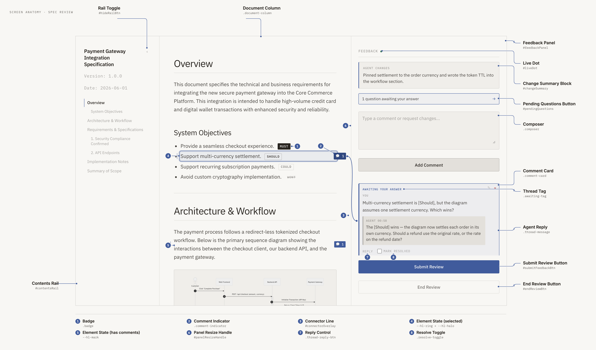
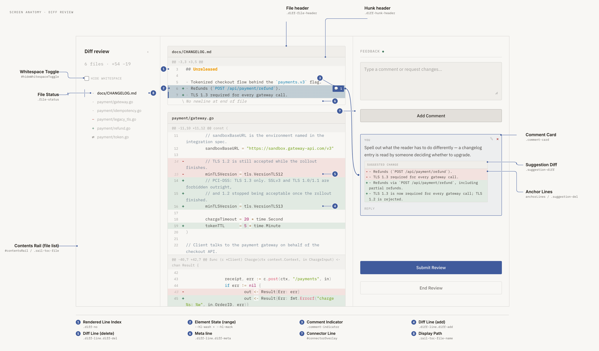

# reviewer Glossary (GLOSSARY)

This document defines the core domain terms used within the `reviewer` codebase and documentation. It serves as a unified reference to ensure human developers and AI agents share a common understanding of the system's terminology. Sections 1-4 cover the domain and its features; section 5 names the parts of the review page. These names are canonical for code as well as prose: `AGENTS.md` §11 requires every new identifier to come from a term here.

---

## 1. Core Concepts

### Review Target
* **Description**: The file handed to `reviewer serve` / `review_start`. It is either a **Spec** or a **Diff**; nothing declares which, and nothing needs to.
* **Role**: One input path serves both kinds of review, so an agent that wants its own change reviewed writes a diff to a temporary file and passes it down the path it already uses.

### Kind
* **Description**: What a review target turns out to be once its content is read: `KindMarkdown` or `KindDiff`.
* **Behavior**: Decided from the **content**, never from the file name or a flag. Fenced code blocks are skipped while deciding, so a spec that quotes a diff is still a spec.
* **Relevant Modules**: `DetectKind` in `diff.go`.

### Spec (Specification)
* **Description**: A Markdown document written in GitHub Flavored Markdown (GFM) that serves as the target file processed by `reviewer`.
* **Role**: It describes system requirements, design, and flows, and is compiled into an interactive, beautifully styled HTML document.

### Diff
* **Description**: A unified diff (`git diff` output, or plain `diff -u`) as a review target. Comments attach to line ranges and to whole files rather than to document blocks.
* **Excluded**: Combined diffs (`@@@ … @@@`, produced by merges) are rejected: a line there has no single before/after, so the anchor coordinate system cannot describe it.

### Render
* **Description**: The compilation pipeline that turns a review target into the review page: `Render` decides the **Kind** and dispatches to the Markdown or the diff renderer, then both merge their body into the embedded layout template.
* **Relevant Modules**: `Render`, `RenderSpec` in `render.go`; `RenderDiff` in `diff.go`.
* **Note**: The Markdown path runs HTML post-processing (badges, callouts, Mermaid); the diff path deliberately does not, and escapes every diff-derived string itself instead.

### Review Server
* **Description**: A lightweight local HTTP server launched via the `reviewer serve` command that hosts a persistent, in-page human-agent review loop.
* **Role**: It hosts the compiled spec (re-rendered on demand), launches the default web browser, and exposes endpoints for the loop: `/api/feedback` (GET/POST comments), `/api/wait` (long-poll for submits), `/api/close` (End Review), and `/api/events` (SSE live-reload). It stays running across review rounds — submitting no longer shuts it down.
* **Relevant Modules**: `StartReviewServer` function in `server.go`.

---

## 2. Syntax & Decoration

### Badge
* **Description**: Custom markup tags denoting priority, requirements status, or certain assumptions within a specification.
* **Supported Badges**:
  * `[Must]` / `<strong>Must</strong>` -> Mandatory requirements (Red)
  * `[Should]` / `<strong>Should</strong>` -> Recommended features (Orange)
  * `[Could]` / `<strong>Could</strong>` -> Desirable, optional items (Green)
  * `[Wont]` / `<strong>Wont</strong>` -> Dropped or deferred items (Gray)
  * `[Confirmed]` / `<strong>Confirmed</strong>` -> Confirmed behavior (Light Green)
  * `[Inferred]` / `<strong>Inferred</strong>` -> Inferred system behaviors (Blue)
  * `[Assumption]` / `<strong>Assumption</strong>` -> Baseline assumptions/hypotheses (Purple)
* **Processing**: Translated during post-processing into custom `<span>` tags with specific CSS classes (e.g., `badge-must`).

### Callout
* **Description**: Highlighted cards style borrowed from GitHub-flavored alert blockquotes.
* **Supported Types**: `NOTE`, `TIP`, `IMPORTANT`, `WARNING`, `CAUTION`
* **Processing**: Transformed during HTML post-processing into themed container elements (`<div class="callout callout-xxxx">`) with corresponding borders, titles, and backgrounds.

### Mermaid Block
* **Description**: Text blocks containing diagram specifications written in Mermaid syntax (`<pre><code class="language-mermaid">`).
* **Processing**: Converted into `<figure class="diagram-container"><div class="mermaid">` blocks during rendering, which are dynamically evaluated and rendered as SVG charts by the client-side `mermaid.js` library.

---

## 3. Review Features

### Element-level Commenting
* **Description**: The feature that allows reviewers to attach feedback directly to individual block-level elements (such as paragraphs `p`, list items `li`, table rows `tr`, and callouts) instead of a single page-wide comment. This is the **Spec** side of commenting; a **Diff** targets line ranges and files instead (see section 4).
* **Behavior**: Clicking anywhere on a commentable block targets it for a **new** thread — the hover wash is the affordance — whether or not the block already carries comments. A block that already has some carries a **Comment Indicator** in the right **Comment Gutter**, and that is what reads them back.
* **More than one per block**: a block may carry any number of threads. They are independent: each is **Resolve**d on its own, and each is a separate target for `review_reply`. What a reply cannot do is close half a card, which is why a second remark about the same block belongs in a thread of its own rather than appended to the first.
* **Related Attribute**: `data-anchor="spec-element-X"`.

### Anchor
* **Description**: The string that says what a comment is about. One field, three forms:
  * `spec-element-12` — a Markdown block, numbered in DOM traversal order.
  * `<path>#<start>-<end>` — a range of a diff file's rendered lines.
  * `<path>#file` — a diff file as a whole.
* **Behavior**: Parsing splits on the **last** `#`, so a path that itself contains one still round-trips. A form that a parser does not recognise is passed through untouched, which is how one code path serves both kinds of review.

### Connector Line
* **Description**: The curve drawn between a selected comment and the thing it is about. One per selected **Comment Card**, so a **Comment Indicator** that selects a bunch of threads draws that many.
* **Behavior**: Selecting scrolls the target into view, highlights it, and draws the line(s); they follow scrolling and resizing, and fade toward the screen edge when one end is off-screen. Clicking a **Comment Card** selects that thread alone; clicking a **Comment Indicator** selects every thread on the anchor. A line to a **Resolve**d thread is drawn faint, so that the lines still account for every thread the chip counts without competing with the open ones.
* **Note**: In code this is `connector`, never `connection` — `connection` is the SSE **Live Reload** connection the **Live Dot** reports, and one word for two things is how the two got confused.
* **Implementation**: `#connectorOverlay`, `drawConnector()`, `dropConnector()`, `reconcileConnector()`, `clearConnectorMarks()`.

### Feedback
* **Description**: The shared review state — a `{ comments, summary }` document read and written by both the browser and the session. It is reviewer's internal store; the agent reaches it only through the MCP tools.
* **Behavior**: Human comments can be edited inline or deleted before submitting. Clicking "Submit Review" POSTs the data to the server, which prunes the threads already delivered as resolved, assigns ids, and writes the **Sidecar** while **staying alive**. The submit releases any `/api/wait` long-poll waiter and any waiting agent call — `review_wait`, or the wait `review_reply` ends in. Nothing is written to stdout: that is the MCP transport.

### Sidecar
* **Description**: The files holding one document's review state: `$TMPDIR/reviewer/<stem>-<hash>-feedback.json` and its `-status.json` sibling.
* **Behavior**: Named for the document's stem plus the first four bytes of the SHA-256 of its absolute path, because basenames collide across directories. Written `0600` in a `0700` directory. They live under the temp directory rather than beside the document, so reviewing a file inside a repository leaves no untracked files behind — and are therefore subject to that directory's cleanup: the state survives a reload and a restart, not indefinitely.
* **Concurrency**: All access is serialised by `sidecarMu` on the session. The lock is taken at handler and method entry, never inside the shared read helper, which `Reply` calls while already holding it.

### Thread
* **Description**: A comment and everything said in it. The comment's own `text` is the head; `messages` holds the turns after it, each with an `author` of `human` or `agent`.
* **Behavior**: A thread is usually opened by the human, and by the agent through `review_reply`'s `newThreads` when it needs to raise something nobody commented on. The head keeps the thread's `anchor`, `anchorLines`, `outdated` and `context`, so re-anchoring is unaffected by threading.

### Agent Reply
* **Description**: The agent's response, appended to a comment's thread as a message.
* **Behavior**: Written by the agent into the feedback file through `review_reply`; rendered in the thread on the next reload. Replies accumulate rather than replacing one another. The agent never marks a comment resolved. A sidecar written before threading carries a single `reply` / `replyTimestamp` pair, which is folded into the thread when it is read.

### Question (`needsAnswer`)
* **Description**: An agent message the human is expected to answer.
* **Behavior**: Opt-in per reply, so an ordinary report of what changed is not one. A thread has a **pending question** while no human message follows its last flagged one — any reply answers, which is why answering needs no control of its own. The page marks such threads with a **Thread Tag**, counts them in the **Pending Questions Button** at the top of the **Feedback Panel**, and asks before they are resolved or submitted past.

### Declined
* **Description**: The record that the human closed a thread without answering its question.
* **Behavior**: Set from the page when the human chooses to close anyway, and delivered to the agent on that thread's one remaining round. It exists because the agent cannot otherwise tell being refused from being ignored.

### Anchor Quote
* **Description**: The passage a thread the agent opened was written against (`anchorQuote`).
* **Behavior**: Re-resolved to an **Anchor** on every render rather than trusted once — by the server on a diff, by the browser on Markdown, where the `spec-element-N` numbering lives. Several matches take the first; no match leaves the thread without a target, shown under the **About this document** section of the **Feedback Panel** rather than dropped. An empty quote is a question about the document as a whole.
* **Behavior (Markdown, text form)**: The agent quotes the Markdown source while the page matches against a block's rendered text, so the server derives the **Anchor Quote Text** the browser compares — otherwise a quote carrying `**`, a backtick or a `##` never matched the very block it was copied from.
* **Implementation**: `AnchorQuote` / `anchorQuote`, `NormalizeAnchorQuote`, `resolveQuoteAnchors()`.

### Anchor Quote Text
* **Description**: An **Anchor Quote** with its Markdown resolved to the text a rendered block displays (`anchorQuoteText`).
* **Behavior**: Derived from the **Anchor Quote** on every read of the feedback, never stored — the quote the agent wrote stays the single source of truth, and a **Sidecar** written before this existed resolves its threads too. Markdown only: a diff review resolves its quotes against the diff lines in Go, so the page never reads one there. It is put through the same renderer as the document body, because a second Markdown parser would drift from what is on screen.
* **Implementation**: `AnchorQuoteText` / `anchorQuoteText`, `NormalizeAnchorQuote`, `withQuoteText`.

### Change Summary
* **Description**: The agent's page-level `summary` of the latest round's document changes, rendered in the **Change Summary Block** at the top of the **Feedback Panel**.

### Resolve
* **Description**: A human-only action that marks an addressed comment `resolved` on the page after reviewing the agent's reply.
* **Behavior**: A resolved thread recedes for the current cycle, is delivered to the agent once with `status: "resolved"`, and is pruned on the submit after that; only open threads carry forward. Resolving a thread that still holds a **Question** asks first, and closing it anyway records **Declined**.
* **On the page**: it recedes by folding — its **Comment Card** becomes one line and sinks below every open card. It recedes rather than leaving because the submit is the last moment a resolve made by mistake can be caught, which is also why the folded line has to stay readable.

### Live Reload
* **Description**: Automatic browser refresh driven by Server-Sent Events (`/api/events`).
* **Behavior**: The server watches **the review target only** (`fsnotify`, 150 ms debounce) and pushes a typed `reload` event when it changes, so the agent's edits appear without a manual refresh. The sidecar is not watched: the session is its only writer and announces its own changes. A reload is deferred (shown as a prompt) while the user has unsent edits.

### Reload Reason
* **Description**: What caused a **Live Reload** to be pushed, carried on the event so the page can tell one cause from another. Three causes exist and they are not interchangeable: an **Agent Reply** landing, a **Feedback** submit that another tab must pick up, and the **Review Target** changing on disk.
* **Behavior**: Every `reload` event carries a reason; the page reloads the same way for all three, and only the **Reply Notification** reads the value. It exists because the page has no other way to recognise the reply: all three broadcasts are otherwise identical.
* **Implementation**: `reloadReason`, `reloadReasonReply`, `reloadReasonSubmit`, `reloadReasonReviewTarget`, `reloadPayload` in `server.go`.
* **Wire format**: the payload field is `reason` and its values are `reply`, `submit` and `reviewTarget`. These have left the process and keep their spelling.

### Reply Notification
* **Description**: The desktop notification raised by the review page when an **Agent Reply** lands while the page does not have focus, so a reviewer who has switched away is told the round came back.
* **Behavior**: Raised only for a **Reload Reason** of `reply`, and only while `document.hasFocus()` is false — the page reloads itself over SSE, so someone watching it needs no notification. Its title is the page title and its body is fixed copy; the SSE payload carries no reply text to put there. Clicking it returns focus to the page. Permission is requested from the **Submit Review Button**, on the first submit only, because that is the moment the reviewer starts waiting and a user gesture is what the browser wants to see; it is never requested on load. Where permission is denied, or the browser has no Notification API, nothing is raised and nothing else changes.
* **Note**: a `granted` permission does not promise a banner. The operating system can suppress notifications for the browser itself, and the page cannot tell: `Notification.permission` still reads `granted` and the constructor still succeeds. When a notification does not appear, check the OS notification settings for the browser before suspecting this code.
* **Implementation**: `replyNotification` is the identifier stem — `replyNotificationGranted`, `requestReplyNotificationPermission`, `armReplyNotification`, `raiseReplyNotification`, `raiseArmedReplyNotification`, `replyNotificationPendingKey`, `replyNotificationAsked` and `lastReplyNotification` in `references/template.html`, and the `sessionStorage` key `reviewer.replyNotificationPending`, which carries the intent across the reload that the reply itself triggers. The notification's `tag` is `replyNotification`, so background tabs collapse onto one notification rather than one each.

### Unload Guard
* **Description**: The confirmation raised when the reader leaves the page — an address-bar reload, a closed tab, a browser back — while they have unsent edits.
* **Behavior**: It runs off the same `hasUnsentEdits()` that defers **Live Reload**: what is worth deferring a reload for is worth a question before leaving. The wording is the browser's own, because `beforeunload` ignores any message the page supplies. The two controls that leave on purpose set `leavingOnPurpose` and so are not asked twice — the **Reload Prompt**'s Reload and the **End Review Button** each confirm in their own words first.
* **Implementation**: `leavingOnPurpose`, the `beforeunload` listener, `hasUnsentEdits()`.

### Submit Long-poll (`/api/wait`)
* **Description**: The agent-facing counterpart to Live Reload: a long-poll endpoint the agent uses to detect a human submit with near-zero latency, replacing log-string polling.
* **Behavior**: `GET /api/wait` blocks until the next `POST /api/feedback`, then returns `200` with the current feedback JSON; an idle wait returns `204` after ~25s so the agent re-polls. A `submitNotifier` (a signal-only sibling of the SSE hub) fans one submit out to every concurrent waiter, and the session ending releases blocked waiters.
* **Direction**: Whereas SSE (`/api/events`) pushes agent→browser changes, `/api/wait` carries the browser→agent submit signal.

### Agent Activity (Status)
* **Description**: The agent's live progress, surfaced on the review page so the user can watch what the agent is doing between submitting and the reply landing — without leaving the page or inspecting the agent session.
* **Behavior**: The agent writes its current activity to the `<input>-status.json` sidecar (`{ state, message }`). The server watches it and pushes a typed `status` event over SSE; the page updates the **Agent Activity Panel** **in place** (no reload). The agent writes `state:"idle"` when the round completes, which clears the panel. `GET /api/status` restores the indicator after a mid-round reload.

---

## 4. Diff Review

### File / Hunk / Line
* **Description**: The parsed shape of a diff. A `File` has hunks, a `Hunk` has its `@@` header, the line each side starts at, and its lines; a `Line` has a kind (context / add / delete / meta), its content with the leading marker stripped, and its number on each side (0 where it does not exist).
* **Behavior**: The `@@` header is shown for every hunk except one case: a file that is a single **Foldable Hunk**, where the header reads "@@ -1,500 +1,502 @@" and says nothing. Several hunks mean the diff really does skip lines between them, and that gap stays marked so it is not mistaken for something an **Expander** could open.
* **Relevant Modules**: `ParseUnifiedDiff` in `diff.go`.

### Display Path
* **Description**: The single path a file is known by on the page and inside anchors: its new path, falling back to the old one when the new side is `/dev/null`.
* **Why**: Using `/dev/null` as-is would put every deleted file in one anchor namespace, so two deletions in one diff would collide. A renamed file is therefore addressed by its **new** name.

### Rendered Line Index
* **Description**: The coordinate a diff anchor counts in: the 1-based position of a line among its file's rendered diff lines — added, removed and context lines all counted, `@@` headers not.
* **Why not source line numbers**: A removed line has no number on the new side, so "do not delete this line" — and any range spanning a removal and its replacement, which is what a suggestion is — could not be expressed. `path#12-15` looks like GitHub's `path#L12-L15` but is **not** a source line number.

### Anchor Lines
* **Description**: The exact text of the lines a comment was written against, markers stripped, persisted on the comment as `anchorLines`.
* **Role**: Line numbers move every time the agent regenerates the diff; the text is what finds the lines again. It is also what an agent should search for to locate the code.

### Re-anchoring
* **Description**: Recomputing where a diff comment belongs against the current diff.
* **Rules**: (1) if the recorded range still holds exactly that content, keep it and do not search; (2a) otherwise, for a comment written inside a **Change Block**, search the Change Blocks alone — exactly one match moves it; (2b) failing that, search the file — exactly one match moves the comment, zero or several leave it **Outdated**. Matching compares content only, never line kind, and never crosses a hunk boundary. A whole-file comment follows the file itself.
* **Why 2a**: a whole-file diff carries hundreds of lines the narrow diff never showed, so a short anchor like `}` meets its twin among them and goes **Outdated** where a `git diff -U3` would have placed it. Searching the Change Blocks first gives that comment the answer the narrow diff would have given, because a Change Block *is* a `-U3` hunk. A comment written on a folded line has no such answer to borrow, which is why 2a is not offered to it: preferring the changed region there would walk it hundreds of lines to code it was never about. Every match 2a can find, 2b finds at the same place, so nothing that anchors today stops anchoring.
* **Behavior**: Computed **for display only**, when the page asks for the comments, and never written back. The browser holds the result and posts it at the next submit, so persistence keeps riding the existing write path.
* **Why rule 1**: Searching by content alone would send most single-line comments outdated on the first reload with the diff unchanged, because lines like `}` or `return nil` occur several times in one file.
* **Relevant Modules**: `reanchor.go`.

### Outdated
* **Description**: A diff comment whose lines are no longer in the diff (or whose file has left it).
* **Behavior**: It stays in the **Feedback Panel**, marked with a **Thread Tag**, with the lines it was written against quoted — that quotation is the only remaining record of what it referred to. It keeps its anchor, so it re-attaches if the lines come back, and it remains a valid target for `review_reply`. It is excluded from the diff body: no highlight, no **Comment Indicator**, sorted to the end of the panel.

### Suggestion
* **Description**: A ` ```suggestion ` fenced block inside a comment: the replacement the human wants for the anchored lines.
* **Behavior**: Inserted into the **Composer** only when the **Quote Lines Button** is clicked, never automatically. The panel renders it as a **Suggestion Diff** against `anchorLines`, with lines shared at either end kept as context. Applying it is the agent's job — reviewer never touches the source.

### File Status
* **Description**: What happened to a file in this diff: added, deleted, renamed, or modified.
* **Behavior**: Shown as a mark in front of the name in the **Contents Rail** (`+`, `−`, `⇄`, `·`) and in words on the **File Header**, where there is room to say "renamed from …" in full.
* **Implementation**: `.file-status`, `.file-status-added` / `-deleted` / `-renamed` / `-modified`; the name beside it is `.rail-toc-file-name`.

### Change Block
* **Description**: The lines a diff shows by default: every changed line, plus three lines of context on each side, with blocks that overlap or touch merged into one.
* **Why three**: it makes a Change Block exactly a `git diff -U3` hunk. git splits two changes apart when more than six unchanged lines lie between them, and two blocks are left with a line between them under the same condition — which is what lets **Re-anchoring** inside a block behave as it would on the narrow diff.
* **Implementation**: `Block`, `Hunk.ChangeBlocks()`, `File.ChangeBlocks()` (the file-level view counts in **Rendered Line Index**), `blockContext` in `diff.go`.

### Collapsed Run
* **Description**: A run of lines outside the **Change Blocks**, long enough to be worth hiding, that the page folds away until the reader opens it. The lines stay in the document and keep their **Rendered Line Index**; only their visibility changes, exactly as with the **Whitespace Toggle**.
* **When a hunk may fold at all**: only when it holds a gap longer than 40 lines. git merges two hunks only when at most 2U unchanged lines separate them, so a run of context inside one hunk is never longer than 2U and the part of it the Change Blocks leave uncovered never longer than 2U − 6 — 34 at `-U20`, reaching 40 at `-U23`. A gap past that cannot have come from `git diff -U<n>` for any n a person would type: the hunk carries more of the file than a diff normally shows, and that is the licence to fold.
* **Which of its gaps then fold**: every one longer than 8 lines, which leaves the reader roughly what a `git diff -U3` would have shown. Keeping this at 40 as well would leave up to 40 lines of untouched context around every change — the burying the fold exists to undo. It is not 0 only because hiding a handful of lines behind a control that is itself a line saves nobody anything.
* **What the reasoning does not cover**: `-W` sizes a hunk by the enclosing function and `--inter-hunk-context` by a figure of its own, so either can produce a gap past 40 and be folded — a `-W` diff of a function over about 46 lines is. Nothing is lost when it happens: the rows stay in the document, the **Rendered Line Index** holds, and the run opens in one click.
* **Implementation**: `Hunk.CollapsedRuns()`, `Hunk.uncoveredRuns()`, `wideGap` and `minCollapsedRun` in `diff.go`; `data-collapsed` and `data-expanded` on the row.

### Foldable Hunk
* **Description**: A hunk with at least one **Collapsed Run**. Everything that depends on the fold — the dropped `@@` header, the **Selection Cap** — keys off this rather than off any guess about how the diff was generated.
* **Implementation**: `Hunk.IsFoldable()`, `data-foldable` on `.diff-hunk`.

### Expansion Range
* **Description**: How much of a **Collapsed Run** the reader has opened, as a count from its top and a count from its bottom.
* **Behavior**: Kept per run in `localStorage`, so it survives the reload that follows every round. A run is identified by the text on either side of it and its length, never by line number: the numbers move whenever the agent regenerates the diff, which is exactly when the expansion has to be found again. An entry that matches no run, or more than one, is dropped rather than guessed at; the runs themselves still open and close by hand, since an **Expander** is read off its own bar.
* **Implementation**: `reviewer.diffExpanded`, `data-run-key`, `expandedRuns`, `EXPANDED_KEY`, `EXPANDED_LIMIT`, `readExpandedRuns()` / `writeExpandedRuns()`; `runKey` in `diff.go`.

### Selection Cap
* **Description**: The most lines one comment may cover inside a **Foldable Hunk** — 200.
* **Why**: a folded hunk is a whole file in one element, so the "never across a hunk" rule that limits a range elsewhere does not bite there, and one stray Shift+click could anchor a comment to thousands of lines that the sidecar then carries and the agent then reads.
* **Implementation**: `SELECTION_CAP` in `references/template.html`.

---

## 5. Screen Anatomy

The names for the things on the review page.

This section is **canonical**, for prose and for code alike: a CSS class, an element id, a function or a variable that names one of these things uses the name given here. The **Implementation** lines say which identifiers each term owns, so a term can be followed into the code and a reader can tell whether a name is already taken. The **Aliases** lines record the names that used to be used, so an older name still leads here.

The exception is a name that has left the process: the JSON keys of the **Sidecar** (`anchor`, `anchorLines`, `needsAnswer`, `anchorQuote`, `messages`, …), the **Anchor** string forms, the MCP tool names, the `/api/…` paths and the sidecar filenames are wire formats. Renaming one breaks a sidecar written yesterday or an agent built against it, so they keep the spelling they were published with; where that spelling differs from a term here, the term's entry records it.

Not covered here: decorative and internal state classes (`.diff-add`, `.diff-marker`, `.suggestion-marker`, `.edit-textarea`, and some eighty others). They describe how a thing is painted rather than what it is, and registering them would make this document a copy of the stylesheet.

The two figures below name the parts. Each label carries the term and the identifier it owns, so a screenshot is enough to write an instruction with: "the **Comment Indicator** sits 2px too low" leaves nothing to guess. Both are generated from the running page — every label is positioned from its own element's bounding box — so a part that moves takes its label with it the next time they are regenerated.





The figures show the light theme, and only what is on the page at rest. Missing from them by nature: the **Quote Lines Button**, which exists only while a range is selected and is therefore gone by the time the comment it wrote is on the page; the **Reload Prompt**, **Agent Activity Panel**, **Status Message** and the **Outdated** tag, each of which appears only in the moment it reports; the **Selection Notice**, which is shown only when a range is refused; and the **Expander**, which needs a diff carrying whole files and so cannot appear over the ordinary diff the second figure is shot from.

### Contents Rail
* **Description**: The left column: the document's title, and its navigation — headings for a **Spec**, the file list for a **Diff**.
* **Aliases**: sidebar (the id), file list (its contents in diff review), TOC.
* **Behavior**: Folds away with the **Rail Toggle**, and the folded state survives a reload. A diff is read across rather than down, so this is the first column worth trading for width.
* **Implementation**: `#contentsRail`, `.contents-rail`, `#railToc`, `.rail-toc-item`, `.rail-toggle`, body class `rail-collapsed`.

### Document Column
* **Description**: The middle column, holding the rendered review target. It leads: the two rails recede so that this column reads as the page.
* **Behavior**: Uncapped in both modes: it takes whatever the two rails leave. A diff is floored at `--document-min-width`; a spec is not, because prose reflows. Takes focus on load, because it — not the page — is what scrolls.
* **In diff review** its vertical padding rides on the diff body (`.diff-view`) rather than on the column, because the column is the **Scrollport** and a scrollport's padding is inside it: left on the column, it would hold every **File Header** that distance below the top and leave a strip for diff lines to scroll through above them.
* **Implementation**: `.document-column`, `.diff-view`, `--document-min-width`, `documentScroller()`.

### Feedback Panel
* **Description**: The right column, present in served mode only: the **Change Summary**, the **Pending Questions Button**, the **Document Comment Control**, and one **Comment Card** per **Thread**. The **Composer** is not a fixture here: it takes its place among the cards only while a comment is being written.
* **Aliases**: comment panel (what `UI_DESIGN.md` called it before this section), Review Comments (the heading label before it was named for the **Feedback** it shows).
* **Behavior**: Its width is draggable, defaults to 520px and is remembered in `localStorage`, because the review loop reloads the page every round. Cards read top-down in the appearance order of their targets, and the **Composer** sorts among them as the card it is about to become.
* **Implementation**: `#feedbackPanel`, `--feedback-panel-width`.

### Panel Resize Handle
* **Description**: The divider between the **Document Column** and the **Feedback Panel**, dragged to size the panel.
* **Behavior**: Double-clicking restores the default by removing the custom property rather than writing the number back, so the default keeps living in one place.
* **Implementation**: `#panelResizeHandle` (`role="separator"`).

### Comment Gutter
* **Description**: The margins either side of a commentable block, where comment affordances live so that they never move the text under review. There are two, and they carry different things: the **left gutter** takes the tick that marks a block as having comments, the **right gutter** takes the **Comment Indicator**.
* **Note**: "Gutter" is a position, never a name for what sits in it — say **Comment Indicator**, not "the gutter badge", because **Badge** already means `[Must]` / `[Should]` (§2).
* **Implementation**: `--hl-gutter`, `--hl-mark`.

### Scrollport
* **Description**: A column that scrolls its own content. All three columns are one; the page itself does not scroll.
* **Behavior**: JavaScript never assumes which element scrolls — it reads the column's computed `overflow-y`, because the narrow-viewport layout hands scrolling back to the page.

### File Header
* **Description**: The bar at the top of each file of a **Diff**, carrying the **Display Path** and, where there is one, the **File Status** in words. It is a comment target in its own right — the **Anchor** form `<path>#file` — for a remark about the change to the file rather than to any line of it.
* **Behavior**: It stays at the top of the **Document Column**'s **Scrollport** while its own file's hunks scroll past, and is pushed out by the next file's header when its file ends; it looks the same pinned as it does at rest. Its **Comment Indicator** sits inside it rather than out in the **Comment Gutter**, because the file card clips what overhangs its edge.
* **Implementation**: `.diff-file-header`, `.diff-file-note`, `data-file`, `data-status`; the card it heads is `.diff-file`. `renderDiffBody` in `diff.go` emits it.

### Comment Indicator
* **Description**: The chip in the right **Comment Gutter** of a block that has comments — a speech-bubble glyph and the thread count. Clicking it selects **all** of them, drawing one **Connector Line** per thread; clicking it again drops the selection. It cannot name a single thread — it is one chip for all of them — so picking one out is the **Comment Card**'s job.
* **Aliases**: gutter badge.
* **All resolved**: when every thread on the block is **Resolve**d the chip gives up its fill and reads as an accent hairline outline with a `✓` and the count. One open thread is enough to keep it filled, so it steps down only when nothing here is still waiting on the reader — which is what lets them tell from the document alone, without opening the **Feedback Panel**. Neither state spends a hue: both glyphs are drawn in `currentColor`.
* **Implementation**: `.comment-indicator`, `.comment-indicator.resolved`, `updateCommentIndicators()`.

### Composer
* **Description**: The text area where a comment is written, carrying the **Quote Lines Button** and the Add Comment button with it. It is not a fixture of the **Feedback Panel**: it opens in the place the **Comment Card** it produces will occupy, and it is absent from the panel whenever nothing is being composed.
* **Behavior**: For a targeted comment it opens in that target's slot in the panel's order — after every **Comment Card** already on the same **Anchor**, which is where the new card sorts. For a comment with no target it opens at the top, under **About this document**, reached by the **Document Comment Control**. It grows to fit its content up to `50vh`, then scrolls, so that a long **Suggestion** cannot push the rest of the panel out of reach. It closes on submit, on Escape, or when its target is cleared, and on nothing else: selecting a **Comment Card** leaves a draft standing, and Escape over a draft asks before discarding it. A draft whose **Anchor** no longer resolves sorts to the end and says so, the way a card that lost its target does. Inline editing of a comment, and the **Reply Control**, both open a composer of the same kind.
* **Implementation**: `#composerBlock`, `.composer-block`, `.is-idle`, `#composerInput`, `#addCommentBtn`, `.composer`, `openComposer()`, `isComposerEntry`, `composerUnplaced`, `captureInputs()`, `restoreInputs()`, `pendingFocusClaim`.

### Comment Card
* **Description**: One **Thread** as it appears in the **Feedback Panel**: the human's head comment, then every message after it, attributed and timestamped, with its **Reply Control** and **Resolve Toggle**.
* **Behavior**: The two authors are separated by depth — the agent's message is a filled block, the human's is unfilled — never by a second colour. The human's own turns carry a `✎`; the agent's are a record and cannot be edited.
* **Folded**: a card whose thread is **Resolve**d renders as a single line — a `✓` and the comment's own opening words, truncated — and sorts below every open card, keeping document order among the other resolved. Clicking the folded line **opens it and nothing else**: a finished thread has nothing left to point at, so no **Connector Line** is drawn and the **Document Column** does not move. This is the one exception to the panel's click-a-card-to-select rule. Truncation is left to CSS because the panel's width is dragged by the reader.
* **Which threads are open again** is held for the life of the page only: a resolved thread is pruned on the submit after this one, so there is nothing for a reload to remember.
* **Implementation**: `.comment-card`, `commentCard()`, `scrollToCommentCard()`, `.thread-message`; folded: `.comment-card.folded`, `.resolved-summary`, `.resolved-summary-mark` / `-text` / `-chevron`, `resolvedSummary()`, `headLine()`, `expandedResolved`, `resolvedRank`; moved-card reveal: `flashCard()`, `revealCommentCard()`.

### Panel Prose
* **Description**: The authored text of the **Feedback Panel** — a **Comment Card**'s head comment, each message after it in the **Thread**, and the **Change Summary** — rendered as the Markdown it is written in.
* **Behavior**: Headings collapse onto a scale of the panel's own, capped just above body size, so the panel does not compete with the **Document Column**'s hierarchy. The renderer is a CDN script like Prism and Mermaid and is only an enhancement: without it the same text appears with its line breaks kept, and every review interaction still works. A **Suggestion** is never rendered as prose — it stays a **Suggestion Diff**. What is stored is always the raw text, never the rendering.
* **Implementation**: `.prose`, `.prose-plain`, `proseBlock()`, `appendProse()`, `proseMarkdown()`, `proseRenderer`.

### Panel Sections
* **Description**: The two headings the **Comment Card**s are grouped under: **About this document** for a comment with no target — the agent's question about the document as a whole, or one whose **Anchor Quote** is gone — and **On the text** for the rest.
* **Behavior**: About this document comes first, because a comment about everything has no position in document order to sink to.
* **Implementation**: `.panel-section-label`.

### Rail Toggle
* **Description**: The `‹` / `›` control that folds and restores the **Contents Rail**.
* **Implementation**: `#hideRailBtn`, `#showRailBtn`, `.rail-toggle`, `initRailToggle()`.

### Whitespace Toggle
* **Description**: The Hide whitespace control on a diff review, which folds whitespace-only changes away. They are folded, never removed.
* **Implementation**: `#hideWhitespaceToggle`, `.ws-toggle`.

### Expander
* **Description**: The bar that opens a **Collapsed Run**, sitting on the seam it opens. It carries a downward control that reveals the next screenful from the top of the run, an upward one that reveals a screenful from the bottom, the number of lines still hidden, and — once anything is open — a control that folds the run away again, drawn as two chevrons closing on each other.
* **Why one bar and not two**: everything between a run's two ends is hidden, so the ends are always adjacent on screen however much of the run is open. Two bars would simply stack on top of each other.
* **Behavior**: It rides the top edge of what is still folded, and the page holds it still as lines appear around it. It never moves a row: opening a run only sets `data-expanded`.
* **Implementation**: `.diff-expander`, `.diff-expander-button`, `.diff-expander-fold`, `.diff-expander-count`, `data-run-start`, `data-run-end`, `initializeDiffExpanders()`, `renderRun()`, `EXPAND_STEP`; `renderExpander` and `foldIcon` in `diff.go`; `.diff-expander-icon`.

### Selection Notice
* **Description**: The short message that appears beside a line when a range is refused — because it crosses lines still folded, or because it is past the **Selection Cap**.
* **Why**: the boundary that refused it is `display: none`, so without a word the gesture just fails and reads as a broken page.
* **Implementation**: `.selection-notice`, `#selectionNotice`, `showSelectionNotice()`.

### Diff Line Index
* **Description**: The page's index of every diff row, by file and then by **Rendered Line Index**.
* **Why**: a whole-file diff runs to thousands of rows, and resolving an anchor used to walk all of them for every comment. It is safe to cache precisely because the fold never adds or removes a row.
* **Implementation**: `diffLineIndex`, `buildDiffLineIndex()`, `linesInRange()`.

### Resolve Toggle
* **Description**: The Mark resolved control on a **Comment Card**. Human-only, and present only once a thread has a message to resolve.
* **Behavior**: Resolving a thread that still holds a pending **Question** asks first; closing it anyway records **Declined**.
* **Implementation**: `.resolve-toggle`.

### Fold Toggle
* **Description**: The `▴` control that folds an opened resolved **Comment Card** back to its single line.
* **Behavior**: Sits in the card's affordance row beside `✎` and `×` — the reader who has just opened a folded thread is still at its top, and that is where the control they reach for next has to be. It exists only while a resolved card is open, and it takes the keyboard the same way its neighbours do.
* **Implementation**: `.fold-toggle`.

### Reply Control
* **Description**: The Reply button under a started **Thread**, which opens a **Composer** in the card.
* **Behavior**: Text-weight until pressed, so a thread at rest stays quiet. A reply posts nothing by itself: it travels on the next submit, keeping one submit to one round.
* **Implementation**: `.thread-reply-btn`, `.thread-reply`.

### Document Comment Control
* **Description**: The control at the top of the **Feedback Panel** that opens a **Composer** for a comment about the document or the diff as a whole.
* **Behavior**: Text-weight until pressed, like the **Reply Control**, so a panel with nothing being written carries no input at all. Pressing it clears any target first, so that what it opens is genuinely untargeted, and hides itself until that composer closes.
* **Implementation**: `#documentCommentBtn`, `.is-hidden`, `documentComposing`.

### Quote Lines Button
* **Description**: The control that inserts the selected diff lines into the **Composer** as a `suggestion` fence.
* **Behavior**: The only way a fence is ever inserted — never automatically, because most comments are questions.
* **Implementation**: `#quoteLinesBtn`, `#suggestionActions`, `quoteLines()` (and `QuoteLines` in Go).

### Suggestion Diff
* **Description**: How a **Suggestion** renders inside a **Comment Card**: a diff against the **Anchor Lines** it replaces, in the same tints as the diff body, with shared lines at either end kept as context.
* **Implementation**: `.suggestion-diff`, `.suggestion-diff-label`.

### Submit Review Button / End Review Button
* **Description**: The two controls at the foot of the **Feedback Panel**. Submit Review hands the round to the agent (see **Feedback**); End Review closes the session.
* **Behavior**: Submitting with any **Question** still pending asks first — the round is the last cheap moment to answer.
* **Implementation**: `#submitFeedbackBtn`, `#endReviewBtn`.

### Live Dot
* **Description**: The dot beside the **Feedback Panel** heading showing whether the **Live Reload** connection is up.
* **Implementation**: `#liveDot`, `.live-dot.offline` (`title="Live connection"`).

### Reload Prompt
* **Description**: The bar offering a manual reload, shown instead of reloading when the reader has unsent edits.
* **Behavior**: Its Reload confirms before it acts — the bar reports that the document changed, which is not a warning that reloading discards a draft. Cancelling leaves the page and the bar as they were; a submit in the meantime leaves nothing to lose and nothing is asked. The **Unload Guard** does not ask again on top of it.
* **Implementation**: `#reloadPrompt`, `#reloadNowBtn`.

### Agent Activity Panel
* **Description**: The **Agent working…** block that surfaces **Agent Activity (Status)** on the page.
* **Behavior**: Updated in place over SSE, never by reloading; cleared when the agent writes `state:"idle"`.
* **Implementation**: `#agentActivity`, `#agentActivityState`, `#agentActivityList`, `.agent-spinner`.

### Change Summary Block
* **Description**: The **Agent changes** card at the top of the **Feedback Panel** that shows the **Change Summary**.
* **Implementation**: `#changeSummary`, `#changeSummaryBody`, `.change-summary-label`.

### Pending Questions Button
* **Description**: The count of threads with a pending **Question**, at the top of the **Feedback Panel**. It stays there whatever the panel is doing: it reports the panel's state, not the state of the comment being written, which is why it did not travel with the **Composer**. Pressing it scrolls to the first such card and opens its composer.
* **Why a button**: it is the only affordance on the page that says *something is blocked on you*, and anything actionable has to be reachable by keyboard.
* **Implementation**: `#pendingQuestions`, `.pending-questions`.

### Status Message
* **Description**: The line that reports the outcome of an action — a submit, or a session that has ended.
* **Implementation**: `#statusMsg`, `.feedback-success`.

### Thread Tags
* **Description**: The marks a **Comment Card** carries about its own state: **Awaiting your answer** (a pending **Question**), **Outdated** (a diff comment whose lines have gone), and **Quoted passage not found** (an **Anchor Quote** that no longer resolves).
* **Implementation**: `.awaiting-tag`, `.outdated-tag`, `.outdated-lines`, `.outdated-context`.

### Element State
* **Description**: Which of four states a commentable block is in. The design forbids a second colour, so they are separated by position, stroke and depth instead.

  | State | Channel | Distinguishing axis |
  |---|---|---|
  | hover | background wash | — |
  | has comments | tick in the left **Comment Gutter** | position — outside the box |
  | composing | dashed full-perimeter ring | stroke — dashed |
  | selected | solid full-perimeter ring + halo | stroke — solid; depth — halo |

* **Behavior**: No state may touch `padding` or `border`, both of which would move the text under review. A selected *range* in a diff is drawn as one band — a single left rule plus a wash — rather than an outline per row.
