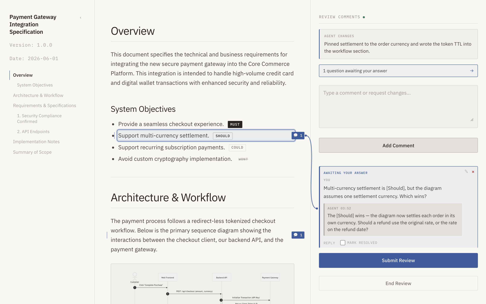
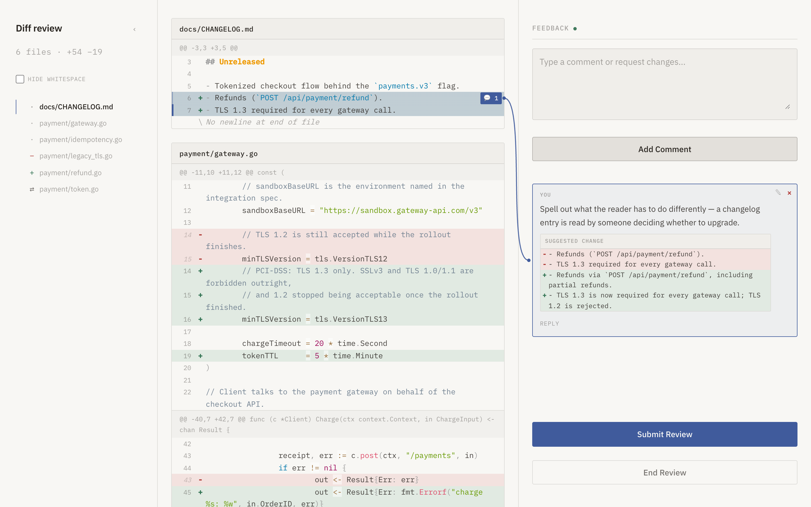

# reviewer

reviewer is a spec-to-readable HTML compiler and review server.





## Features

- Compiling Markdown to styled HTML documents
- Reviewing unified diffs, detected from the file's content — no flag, no separate subcommand
- Interactive local review server
- Gutter commenting on specific block elements, and on line ranges or whole files of a diff
- Comments that follow their lines into the next round, by content rather than by line number
- ` ```suggestion ` blocks, shown in the panel as a diff against the lines they replace
- A resizable comment panel and a foldable contents rail
- Inline comment editing (with keyboard accessibility) and deletion before submission
- A built-in MCP server, so AI agents drive the review loop through standard tool calls

## Synopsis

```console
$ reviewer build <input.md|input.diff> -o <output.html>
$ reviewer serve <input.md|input.diff> -p <port>
$ reviewer mcp
$ reviewer agent-skill explain
```

Both commands take either a Markdown document or a unified diff; which one it is is decided from
the file's content:

```console
$ git diff > /tmp/review.diff
$ reviewer serve /tmp/review.diff
```

## Installation

Using Homebrew:

```console
$ brew install handlename/tap/reviewer
```

Or using `go install`:

```console
$ go install github.com/handlename/reviewer/cmd/reviewer@latest
```

## For AI agents

`reviewer mcp` runs reviewer as an [MCP](https://modelcontextprotocol.io/) server over stdio.
It is the agent-facing entry point, and it owns the whole review: it renders the document, serves
it, opens the browser, and exposes four tools.

| Tool | Purpose |
| --- | --- |
| `review_start` | Open a Markdown document or a unified diff for review. Returns the review URL. |
| `review_wait` | Block until the human submits. Returns their comments. |
| `review_reply` | Reply in each comment's thread — asking a question if you need one — open threads of your own, and summarise the round. |
| `review_progress` | Report the agent's current activity, live, on the review page. |

An agent can have its **own change** reviewed the same way: write `git diff` to a temporary file
and open that. Comments then come back anchored to line ranges (`<path>#<start>-<end>`, positions
among the rendered diff lines — not source line numbers) or to whole files (`<path>#file`), with
the exact text of the anchored lines in `anchorLines`, and may carry a ` ```suggestion ` block to
apply. Regenerate the diff into the same file each round: comments follow their lines by content,
and only go `outdated` when those lines are gone.

The loop is: `review_start`, then `review_wait`, edit the document, `review_reply`, and back to
`review_wait`. `review_wait` reports `submitted`, `timeout` (nothing yet — call again), or
`session_ended` (the human clicked **End Review**). A timeout is an ordinary result, not a
failure, so `--wait-timeout` can be tuned freely.

A comment is a **thread**: its text is the first message and `messages` holds the turns after it.
The exchange runs both ways. An agent that is unsure can set `needsAnswer` on a reply, or open a
thread of its own with `newThreads` against a passage it quotes; the page marks such a thread,
counts it, and asks the human before it is closed. If they close it anyway the message comes back
marked `declined` — being refused is reported, not left to be inferred from silence.

Marking a comment resolved is the human's decision alone; no tool can do it. A resolved thread is
delivered once, with `status: "resolved"`, and is gone from the round after that.

This repository also ships the `review-doc` agent skill, which is simply the workflow written
down. The workflow itself is compiled into the `reviewer` binary and printed by
`reviewer agent-skill explain`; the distributed skill file at
[`skills/review-doc/`](skills/review-doc/) does nothing but point at that command. An installed
skill file is frozen at install time, so keeping the instructions in the binary is what stops
an agent from following a workflow that its `reviewer` no longer implements. The canonical text
lives in [`references/skills/review-doc.md`](references/skills/review-doc.md).

Either way, the `reviewer` CLI must be on your `PATH` — install it first (see
[Installation](#installation)).

### Claude Code

This repository is also a [Claude Code plugin marketplace](https://code.claude.com/docs/en/plugin-marketplaces).
Add the marketplace once, then install the plugin. The plugin registers the MCP server for you:

```console
$ claude plugin marketplace add handlename/reviewer
$ claude plugin install reviewer@reviewer
```

### Other AI agents

Register the MCP server with your client. For Claude Code without the plugin:

```console
$ claude mcp add reviewer -- reviewer mcp
```

Agents supporting `gh skill` (GitHub Copilot, Gemini CLI, Cursor, and others) can install the
workflow description with the GitHub CLI, then register the server the way that client expects:

```console
$ gh skill install handlename/reviewer review-doc
```

## License

MIT

## Author

@handlename
