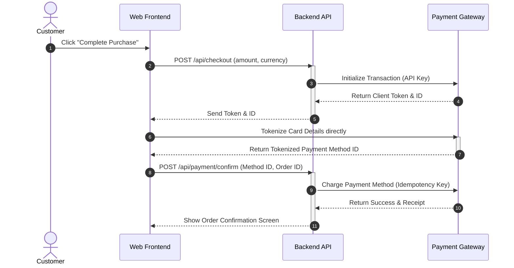

# Overview

This document specifies the technical and business requirements for integrating the new secure payment gateway into the Core Commerce Platform.
This integration is intended to handle high-volume credit card and digital wallet transactions with enhanced security and reliability.

## System Objectives
- Provide a seamless checkout experience. [Must]
- Support multi-currency settlement. [Should]
- Support recurring subscription payments. [Could]
- Avoid custom cryptography implementation. [Wont]

---

# Architecture & Workflow

The payment process follows a redirect-less tokenized checkout workflow. Below is the primary sequence diagram showing the interactions between the checkout client, our backend API, and the payment gateway.



---

# Requirements & Specifications

## 1. Security Compliance [Confirmed]

All network communication must adhere to stringent security standards to satisfy PCI-DSS Compliance.

> [!IMPORTANT]
> All APIs processing payment information must use TLS 1.3 for encryption in transit. Legacy protocols like SSLv3 and TLS 1.0/1.1 are explicitly forbidden.

> [!CAUTION]
> Under no circumstances should raw Card Verification Values (CVV) or Primary Account Numbers (PAN) be logged in our application log files.

## 2. API Endpoints

Below is the structured list of APIs to be exposed by the new service.

| Endpoint | Method | Description | Priority | Status |
|---|---|---|---|---|
| `/api/checkout` | `POST` | Initialize the transaction and retrieve a token. | [Must] | [Confirmed] |
| `/api/payment/confirm` | `POST` | Finalize the payment processing on backend. | [Must] | [Confirmed] |
| `/api/payment/refund` | `POST` | Refund a processed payment. | [Should] | [Inferred] |
| `/api/payment/history` | `GET` | Retrieve past payments for a specific user. | [Could] | [Assumption] |

---

# Implementation Notes

Here is a snippet showing how idempotency should be handled using a UUID header in the request context:

```go
package payment

import (
	"context"
	"net/http"
)

// [Confirmed] IdempotencyKey must be extracted from standard headers.
// The raw "[Must]" string here must NOT be replaced with a badge.
func ProcessPayment(ctx context.Context, req *http.Request) error {
	idempotencyKey := req.Header.Get("X-Idempotency-Key")
	if idempotencyKey == "" {
		// This is a [Must] requirement in order to prevent double-charging!
		return ErrMissingIdempotencyKey
	}
	return nil
}
```

> [!TIP]
> Make sure to cache successful payment token responses for 5 minutes using Redis to optimize response times.

> [!NOTE]
> The sandbox environment URL is `https://sandbox.gateway-api.com/v3`.

---

# Summary of Scope

- **Credit/Debit Card Support** [Must]
- **Apple Pay / Google Pay Support** [Should]
- **Cryptocurrency Support** [Wont]
- **Automatic Retries on Network Failure** [Should]
